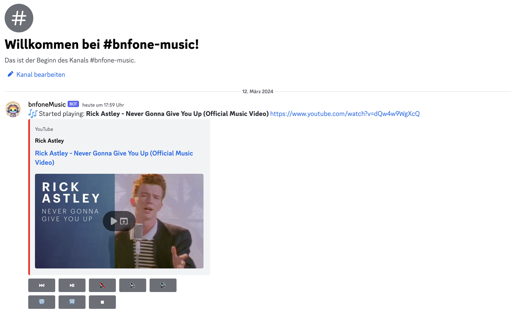

<p align="center">
  
</p>

<h1 align="center"> EylDUyX0gcxJI8Music - A Discord Music Bot</h1>

> This is a fork of the original [EvoBot](https://github.com/eritislami/evobot), a Discord Music Bot built with TypeScript, discord.js & uses Command Handler from [discordjs.guide](https://discordjs.guide). This version includes enhancements and additional features to improve user experience and functionality.


## 🌟 Quickstart & Support

If you want to quickly add this bot to your Discord server and support its development, consider making a donation. Your contribution will help maintain and improve the bot, and as a token of appreciation, you will receive an invitation link to add the bot to your Discord server.

[](https://donate.stripe.com/6oE2bm9ajcU49A43cg)
[Donate 💖](https://donate.stripe.com/6oE2bm9ajcU49A43cg)

**💸 Donation Options:** You can choose the amount you wish to donate; every contribution is welcome and appreciated. Thank you for your generosity!

**⚠️ Important Note:** While we strive to provide the best service possible, please note that we cannot guarantee 100% uptime. However, your donations greatly assist us in improving the bot's reliability and performance. Thank you for your understanding and support!


## 📋 Requirements

1. Discord Bot Token **[Guide](https://discordjs.guide/preparations/setting-up-a-bot-application.html#creating-your-bot)**  
   1.1. Enable 'Message Content Intent' in Discord Developer Portal
2. Spotify Client ID & Secret *-> can be requested at [Spotify Developer Dashboard](https://developer.spotify.com/dashboard)
3. Node.js 16.11.0 or newer

## 🛠️ Getting Started

```sh
git clone https://github.com/EylDUyX0gcxJI8/DiscordMusicBot-evobot.git  # Clone the forked repository
cd DiscordMusicBot-evobot
npm install
```

After installation finishes, follow the configuration instructions and then run `npm run start` to start the bot.

## ⚙️ Configuration

Copy or Rename `config.json.example` to `config.json` and fill out the values:

⚠️ **Note: Never commit or share your token or api keys publicly** ⚠️

```json
{
  "TOKEN": "",  // Your Discord Bot Token
  "SPOTIFY_CLIENT_ID": "",   // Your Spotify Client ID
  "SPOTIFY_CLIENT_SECRET": "", // Your Spotify Client Secret
  "MAX_PLAYLIST_SIZE": 10,
  "PRUNING": false,
  "LOCALE": "en",
  "DEFAULT_VOLUME": 100,
  "STAY_TIME": 30
}
```

## 🐳 Docker Configuration

For those who would prefer to use our [Docker container](https://hub.docker.com/repository/docker/eritislami/evobot), you may provide values from `config.json` as environment variables.

```shell
docker run -e TOKEN=your_discord_bot_token -e SPOTIFY_CLIENT_ID=your_spotify_client_id -e SPOTIFY_CLIENT_SECRET=your_spotify_client_secret EylDUyX0gcxJI8/DiscordMusicBot-evobot -d
```

**Docker Compose**

```yml
version: '3.8'

services:
  discord_music_bot:
    image: EylDUyX0gcxJI8/DiscordMusicBot-evobot
    container_name: discord_music_bot
    environment:
      - TOKEN=your_discord_bot_token
      - SPOTIFY_CLIENT_ID=your_spotify_client_id
      - SPOTIFY_CLIENT_SECRET=your_spotify_client_secret
    restart: always
```

## 📝 Features & Commands

- 🎶 Play music from YouTube, Spotify, and Apple Music via URL
- 🔎 Play music using search queries
- 📃 Play YouTube, Spotify, and Apple Music playlists via URL
- 🔎 Search and select music to play
- 🎛️ Volume control, queue system, loop/repeat, shuffle, and more
- 🎤 Display lyrics for the playing song
- ⏸️ Pause, resume, skip, and stop music playback
- 📱 Media Controls via Buttons
- 🌍 Supports multiple locales



> **Note:** For Spotify and Apple Music integration, the bot converts the provided links to YouTube links before playing, ensuring compatibility and a broader range of music availability. The [Odesli.co API](https://odesli.co) is used for that.


## 🌎 Locales

This fork supports additional locales. For a complete list, please refer to the original repository. If you want to contribute by adding new locales, please check the contributing section.

## 🤝 Contributing to This Fork

1. Clone your fork: `git clone https://github.com/your-username/evobot.git`
2. Create your feature branch: `git checkout -b my-new-feature`
3. Commit your changes: `cz` OR `npm run commit` (Avoid using `git commit` directly)
4. Push to the branch: `git push origin my-new-feature`
5. Submit a pull request to the original repository and mention that it's for the forked version

--- 
**Note:** This fork is maintained separately from the original  [EvoBot](https://github.com/eritislami/evobot). For changes specific to this fork, ensure to target the correct repository when submitting pull requests or issues.

